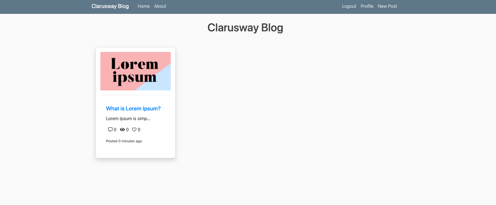

# SDA-CAPSTONE : Blog Page Application (Django) deployed on AWS Application Load Balancer with Auto Scaling, S3, Relational Database Service(RDS), VPC's Components

## Description

The Clarusway Blog Page Application aims to deploy blog application as a web application written Django Framework on AWS Cloud Infrastructure. This infrastructure has Application Load Balancer with Auto Scaling Group of Elastic Compute Cloud (EC2) Instances and Relational Database Service (RDS) on defined VPC. RDS gets the password and username via SSM parameters. User is able to upload pictures and videos on own blog page and these are kept on S3 Bucket. After deploying the application, we will monitor our nodes with Prometheus and Graphana. This architecture will be created by Firms DevOps Guy.

## Problem Statement


- Your company has recently ended up a project that aims to serve as Blog web application on isolated VPC environment. You and your colleagues have started to work on the project. Your Developer team has developed the application and you are going to deploy the app in production environment.

- Application is coded by Clarusway Fullstack development team and given you as DevOps team. App allows users to write their own blog page to whom user registration data should be kept in separate MySQL database in AWS RDS service and pictures or videos should be kept in S3 bucket. The object list of S3 Bucket containing movies and videos is recorded on DynamoDB table. 

- Application will be prepared using IAC tool. First deploy the app simply in a test enviroment to understand how it works.

- The web application will be deployed using Django framework.

- The Web Application should be accessible via web browser from anywhere.

- You are requested to push your program to the project repository on the Github. You are going to pull it into the webservers in the production environment on AWS Cloud. 

In the architecture, you can configure your infrastructure using the followings,

  - The application stack should be created with new AWS resources.

  - Specifications of VPC:

    - VPC has two AZs and every AZ has 1 public and 1 private subnets.

    - VPC has Internet Gateway

    - One of public subnets has NAT Gateway.

    - You might create new instance as Bastion host on Public subnet or you can use NAT Gateway.

    - There should be managed private and public route tables.

    - Route tables should be arranged regarding of routing policies and subnet associations based on public and private subnets.

  - You should create Application Load Balancer with Auto Scaling Group of Ubuntu 22.04 EC2 Instances within created VPC.

  - You should create RDS instance within one of private subnets on created VPC and configure it on application.

  - The Auto Scaling Group should use a Launch Template in order to launch instances needed and should be configured to;

    - use all Availability Zones on created VPC.

    - set desired capacity of instances to  ` 2`

    - set minimum size of instances to  ` 2`

    - set maximum size of instances to  ` 3`

    - set health check grace period to  ` 300 seconds`

    - set health check type to  ` ELB`

    - Scaling Policy --> Target Tracking Policy

      - Average CPU utilization (set Target Value ` %70`)

      - seconds warm up before including in metric ---> `200`

  - ALB configuration;
    
    - Application Load Balancer should be placed within a security group which allows HTTP (80) and HTTPS (443) connections from anywhere. 

    - Target Group
      - Health Check Protocol is going to be HTTP

    - Prepare Django environment on EC2 instance based on Developer Notes,

    - Download the "clarusway_aws_capstone" folder from Github repository,

    - Install the requirements using requirements.txt in 'clarusway_aws_capstone' folder

    - Deploy the Django application on port 80.

    - Launch Template only allows HTTP (80) and HTTPS (443) ports coming from ALB Security Group and SSH (22) connections from anywhere.

    - EC2 Instances type can be configured as `t3.micro`.

    - Instance launched should be tagged `Clarusway AWS Capstone Project`

    - Since Django App needs to talk with S3, S3 full access role must be attached EC2s. 

  - For RDS Database Instance;
  
    - Instance type can be configured as `db.t4g.micro`

    - Database engine can be `MySQL` with version of `8.0.40`.

    - RDS endpoint should be addressed within settings file of blog application that is explained developer notes.

    - Please read carefully "Developer notes" to manage RDS sub settings.

    - !!!!! Database username and password will be retrieved from SSM Parameter You need to modify the "src/cblog/settings.py" according to SSM parameter. 

  - Create SSM parameters in configuration below: 

     - Create a parameter for `database master password`  :
      `Name`         : /<yourname>/capstone/password              
      `Type`         : SecureString   (So AWS encrypts sensitive data using KMS)

      - Create parameter for `database username`  :
      `Name`         : /<yourname>/capstone/username             
      `Type`         : SecureString  (So AWS encrypts sensitive data using KMS)

      - Create parameter for `Github TOKEN`  : (use your own project Github TOKEN as value)
      `Name`         : /<yourname>/capstone/token             
      `Type`         : SecureString   (So AWS encrypts sensitive data using KMS)


  - As S3 Bucket

    - First S3 Bucket

      - It should be created within the Region that you created VPC

      - Since development team doesn't prefer to expose traffic between S3 and EC2s on internet, Endpoint should be set on created VPC. 

      - S3 Bucket name should be addressed within configuration file of blog application that is explained developer notes.
    
    - Second S3 Bucket 
      
      - This Bucket is going to be used for failover scenario. It has just a basic static website that has a picture said "the page is under construction"
  
    - Retrieving Database username and password via SSM Parameter Store (Note: you need to modify the "src/cblog/settings.py" according to SSM parameter.) 

    - First create the application on AWS console.

## Project Skeleton 

```text
clarusway_blog_proj (folder)
|
|----Readme.md               # Given to the students (Definition of the project)
|----src (folder)            # Given to the students (Django Application's )
|----requirements.txt        # Given to the students (txt file)
|----developer_notes.txt     # Given to the students (txt file)
```

## Expected Outcome



### At the end of the project, following topics are to be covered;

- Bash scripting

- AWS EC2 Launch Template Configuration

- AWS VPC Configuration
  - VPC
  - Private and Public Subnets
  - Private and Public Route Tables
  - Managing routes
  - Subnet Associations
  - Internet Gateway
  - NAT Gateway

- AWS EC2 Application Load Balancer Configuration

- AWS EC2 ALB Target Group Configuration

- AWS EC2 ALB Listener Configuration

- AWS EC2 Auto Scaling Group Configuration

- AWS Relational Database Service Configuration

- AWS EC2, RDS, ALB Security Groups Configuration

- IAM Roles configuration

- S3 configuration

- Git & Github for Version Control System

### At the end of the project, students will be able to;

- Construct VPC environment with whole components like public and private subnets, route tables and managing their routes, internet Gateway, NAT Gateway. 

- Apply web programming skills, importing packages within Python Django Framework

- Configure connection to the `MySQL` database.

- Demonstrate bash scripting skills using `user data` section within launch template to install and setup Blog web application on EC2 Instance.

- Demonstrate their configuration skills of AWS VPC, Application Load Balancer, ALB Target Group, ALB Listener, Auto Scaling Group, S3, RDS.

- Apply git commands (push, pull, commit, add etc.) and Github as Version Control System.

## Steps to Solution
  
- Step 1: Create Dedicated VPC And Whole Components

- Step 2: Create Security Groups (ALB ---> EC2 ---> RDS)

- Step 3: Prepare Your Github Repository

- Step 4: Creating Parameters in SSM Parameter Store 

- Step 5: Create RDS

- Step 6: Create S3 Bucket

- Step 7: Create NAT Gateway in Public Subnet

- Step 8: Update settings.py File and Push to Github Repo  

- Step 9: Prepare A Test Instance For Userdata

- Step 10: Create SDA-Admin-Node EC2 Instance (JumpBox/Ansible Control Node/Monitoring/Management)

- Step 11: Create The Infrastructure With Terraform

- Step 12: Configure Ansible on "admin-node"

- Step 13: Write a Playbook to Configure Remote Nodes to Work With Prometheus

- Step 14: Update prometheus.yaml File to Scrape Metrics From Nodes With Service Discovery

- Step 15: Create Route 53 with Failover settings

- Step 15: Visualizing Metrics With Graphana

## Notes

- RDS database should be located in private subnet. just EC2 machines that has ALB security group can talk with RDS.

- RDS is located on private groups and only EC2s can talk with it on port 3306

- ALB is located public subnet

- EC2's are located in private subnets and only ALB can talk with them


## Resources

- [Python Django Framework](https://www.djangoproject.com/)

- [Python Django Example](https://realpython.com/get-started-with-django-1/)

- [AWS CLI Command Reference](https://docs.aws.amazon.com/cli/latest/index.html)
